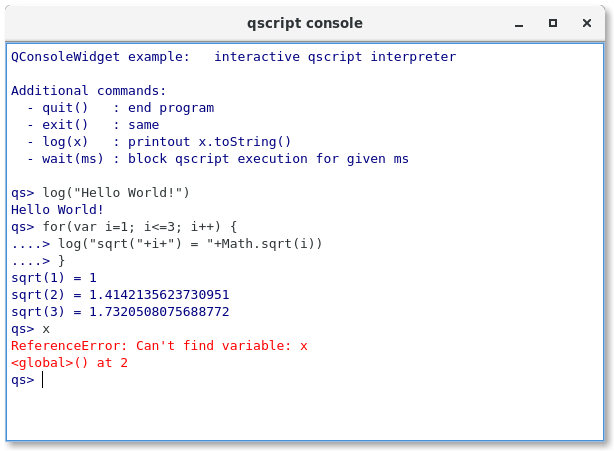

# QConsoleWidget

A lightweight Qt5 console widget based on QPlainTextEdit providing 
also a QIODevice interface.

It can be used as an interactive scripting terminal or a log window.
Features include standard console-like editing, command history, 
formatted input, output & error streams.

TODO: tab completion, syntax highlighting

## Usage

Instantiate the widget and set it to input mode. Connect a QObject slot
to the consoleCommand signal to receive the user input.

```c++
QConsoleWidget w;
w.writeStdOut("enter command> ");
w.setMode(QConsoleWidget::Input);
QObject::connect(&w,SIGNAL(consoleCommand(QString)),MyQObject,SLOT(evalCommand(QString)))
...
MyQObjet::evalCommand(const QString code)
{
    ...
}
```

Alternatively you can use a QTextStream to interact with QConsoleWidget:

```c++
QConsoleWidget w;
w.device()->open(QIODevice::ReadWrite); // open the console's QIODevice
QTextStream os(w);
os << "Hello World!" << endl; // output goes to the widget
```

It can also be used with an input stream

```c++
os << "Enter an integer n = ";
QTextStream is(w);
int n;
w.device()->waitForReadyRead();
is >> n;
```
however the above code is not so efficient as it enters a local loop waiting for
user input. Using the signal/slot mechanism is recommended.

## Example

The included example implements a graphical scripting console for QtScript.



